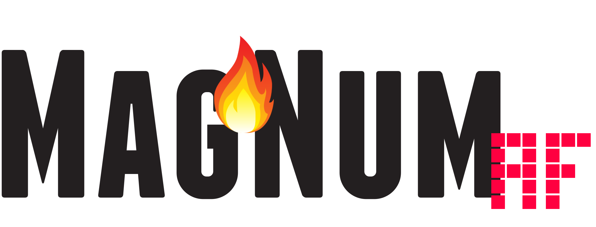

**magnum.af**: A finite differences GPU-accelerated micromagnetic and atomistic simulation software
=====
# Physical Methods
* Micromagnetic Model including the following interactions:
    * Demagnetization (regular, true PBC, non-equidistant)
    * Exchange (Neumann BC, PBC)
    * Anisotropy (uniaxial and cubic)
    * Dzyaloshinskii-Moriya (interface, bulk, D2d)
    * Ruderman-Kittel-Kasuya-Yosida (RKKY)
    * Slonczewski spin transfer torque
    * External field
* Atomistic Spin Model with interactions:
    * Dipole-Dipole
    * Exchange
    * Uniaxial Anisostropy
    * Interface Dzyaloshinskii-Moriya
    * External field
* Adaptive Runge-Kutta methods for solving the time-dependent Landau-Lifshitz-Gilbert equation:
    * Runge-Kutta-Fehlberg (RKF45)
    * Dormand-Prince (DP45 and DP78)
    * Bogacki-Shampine (BS45 and BS23)
* Micromagnetic and Atomistic Energy Minimization
    * LBFGS-Minimizer
    * Precession-free LLG integration
* Stochastic Langevin Dynamics
    * Stochastic Heun
    * Semi-implicit Heun
* String Method for Energy Barrier Calculations


# Software Architecture
**magnum.af** is a monolithic C++ application with python-bindings for a script-style user interface.
* The C++ core project is located at [magnumaf/](magnumaf/)
    * Includes all interactions and solvers
    * Example scripts are found in [magnumaf/examples/](magnumaf/examples/)
* Python bindings in [python/](python/)
  * Enable a script-style user interface
  * API compatible with numpy arrays
  * Provides additional utilities handling user input

**magnum.af** makes extensive use of the [arrayfire GPU library](https://github.com/arrayfire/arrayfire):
* Convenient abstraction of GPU-hardware
* Both used in the API and internally
* Hardware-neutral with support for CUDA, OpenCL and CPU backends
    * Provides a common container for all backend
    * Runs on both Nvidia(R) and AMD(R) devices as well as on any x86 CPU
    * Backends can be set at startup

# Code Repositories
**magnum.af** is publicly hosted on github as well as self-hosted on our gitlab server:
* github: [https://github.com/magnum-af/magnum.af](https://github.com/magnum-af/magnum.af)
* gitlab: [https://git.exp.univie.ac.at/paul/magnum.af](https://git.exp.univie.ac.at/paul/magnum.af)


# Documentation
HTML documentation is available on [https://magnum-af.github.io](https://magnum-af.github.io)

# Simulation Script Examples
Various example scripts are found in the respective directories for python in [python/examples/](python/examples/) and for c++ in [magnumaf/examples/](magnumaf/examples/) as well as in the html-documentation under 'Examples'.

The following is an example of the python API for the standard problem 4 (full example under [python/examples/sp4.py](python/examples/sp4.py)):
```python
import arrayfire as af
import magnumaf as maf

# physical dimensions in [m] and discretization
x, y, z = 500e-9, 125e-9, 3e-9
nx, ny, nz = 100, 25, 1

# initial magnetization
m0 = af.constant(0.0, nx, ny, nz, 3, af.Dtype.f64)
m0[1:nx-1, :, :, 0] = 1.0
m0[     0, :, :, 1] = 1.0
m0[    -1, :, :, 1] = 1.0

# creating **magnum.af** objects
mesh = maf.Mesh(nx, ny, nz, dx=x/nx, dy=y/ny, dz=z/nz)
state = maf.State(mesh, Ms = 8e5, m = m0)

# define interactions
dmg = maf.DemagField(mesh)
exc = maf.ExchangeField(A = 1.3e-11)

# setup integrator
llg = maf.LLGIntegrator(alpha = 1.0, terms = [dmg, exc])
outfile = open("m.dat", "w")

# relaxing
while state.t < 1e-9:
    llg.step(state)
    print(state, file = outfile)

# preparing switch
H_ext = af.constant(0.0, nx, ny, nz, 3, af.Dtype.f64)
H_ext[:, :, :, 0] = -24.6e-3/maf.Constants.mu0
H_ext[:, :, :, 1] = 4.3e-3/maf.Constants.mu0
ext = maf.ExternalField(H_ext)
llg.add_terms(ext)
llg.alpha=0.02

# switching
while state.t < 2e-9:
    llg.step(state)
    print(state, file = outfile)
```

Plotting the generated data yields:


# Installation Guide
## Docker:
The easiest way to get started is to download the current docker image from our [gitlab registry](https://git.exp.univie.ac.at/paul/magnum.af/container_registry).
There you can choose between the CPU image or the CUDA image. To download the CUDA image, use:

`$ docker pull git.exp.univie.ac.at:4567/paul/magnum.af:latest`

Otherwise, you could build the GPU image provided in the Dockerfile by running the following command in the project's root directory:

`$ nvidia-docker build -t magnum.af -f Dockerfile --build-arg user="$UID" .`

For CPU support only use:

`$ docker build -t magnum.af.cpu -f Dockerfile.cpu --build-arg user="$UID" .`

For running simulations, you may use the provided script in [bash/magnum.af.docker](bash/magnum.af.docker), which manages volume mounting and sets permissions such that output files can be written to the output folder. Use e.g.:

`$ magnum.af.docker sp4.py`

## Local installation:
For optional GPU-support, first install a driver provided by your vendor.
If you only want CPU-support, proceed to the next section.

### GPU Driver Installation

Make sure your user is part of the video group using `$groups | grep video`. 

If not, add your user to the video group:

`$ sudo usermod -a -G video $LOGNAME`

perform a logout-login for the changes to have effect.

In the following, choose either NVIDIA or AMD depending on your hardware:

#### a) NVIDIA: nvidia-driver and CUDA:
following [linuxconfig.org](https://linuxconfig.org/how-to-install-the-nvidia-drivers-on-ubuntu-18-04-bionic-beaver-linux):

`$ sudo ubuntu-drivers autoinstall`

Note:
if the driver version provided by the repo is not sufficient, use a ppa instead:

`$ sudo add-apt-repository ppa:graphics-drivers && sudo apt-get update`

And select the proper driver version, e.g.:

`$ sudo apt install nvidia-driver-418 nvidia-settings`


install CUDA with

`$ sudo apt install nvidia-cuda-toolkit`

#### b) AMD: AMDGPU driver and OpenCL
Follow [linuxconfig.org](https://linuxconfig.org/how-to-install-the-latest-amd-radeon-drivers-on-ubuntu-18-04-bionic-beaver-linux)

On the tested system, the install script needed to be invoked with the option `--opencl=legacy`
(tested with driver: amdgpu-pro-19.20-812932-ubuntu-18.04 for Radeon 580 series GPU):

`$ ./amdgpu-pro-install --opencl=legacy -y`

for cmake to find OpenCl run:

`$ sudo apt install ocl-icd-opencl-dev`

### Further steps
The up-to-date way for local installation is to manually follow the steps from the [Dockerfile](Dockerfile) or or [Dockerfile.cpu](Dockerfile.cpu), respectively.

Alternatively, follow these steps (not always up-to-date):

#### Install Arrayfire
 For version 3.6.2:

`$ wget https://arrayfire.s3.amazonaws.com/3.6.2/ArrayFire-v3.6.2_Linux_x86_64.sh .`

`$ chmod +x ArrayFire-v3.6.2_Linux_x86_64.sh`

`$ sudo ./ArrayFire-v3.6.2_Linux_x86_64.sh  --include-subdir --prefix=/opt`

For the loader to find the arrayfire lib use either:

`$ echo /opt/arrayfire/lib > /etc/ld.so.conf.d/arrayfire.conf`

`$ sudo ldconfig`

Or add the following line to your .bashrc file:

`$ echo 'export LD_LIBRARY_PATH=/opt/arrayfire/lib:$LD_LIBRARY_PATH' >> .bashrc`

#### Install dependencies
`$ sudo apt install libvtk7-dev libgmock-dev libboost-program-options-dev`

#### Install Python Packages
`$ sudo pip3 install cython`

`$ sudo pip3 install arrayfire`

#### Build **magnum.af**
Prerequisites:
* A C++17 compiler like gcc or clang
* [CMake](http://www.cmake.org) 2.8 or newer

`$ mkdir build && cd build && cmake .. && make -j`

Install to system directories using:

`$ sudo make install`

To uninstall afterwards, use:

`$ sudo make uninstall`


For python to find the shared library, add the install directory to the PYTHONPATH, e.g.:

`$ echo 'export PYTHONPATH=/usr/local/lib/:$PYTHONPATH' >> .bashrc`

or alternatively, add a symbolic link to a folder in the PYTHONPATH, e.g. for python 3.6
$ `sudo ln -s /usr/local/lib/magnumaf.so /usr/lib/python3.6/
